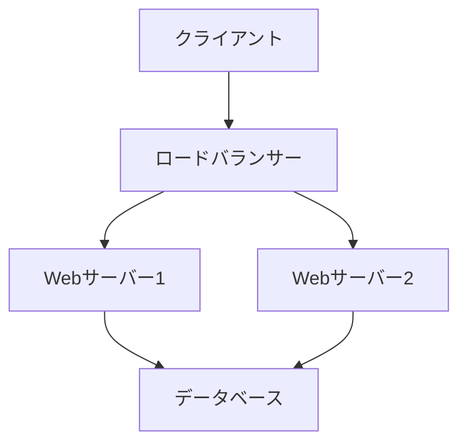

# システム仕様書

## システム概要

本システムは、ユーザー管理とコンテンツ管理を統合したWebアプリケーションです。

## 技術スタック

### フロントエンド
- React 18.x
- TypeScript 5.x
- Tailwind CSS 3.x

### バックエンド
- Node.js 20.x
- Express 4.x
- PostgreSQL 15.x

## システム構成



## API仕様

### ユーザー管理API

#### ユーザー登録
```http
POST /api/v1/users
Content-Type: application/json

{
    "username": "string",
    "email": "string",
    "password": "string"
}
```

#### レスポンス
```json
{
    "id": "string",
    "username": "string",
    "email": "string",
    "createdAt": "string"
}
```

## データベース設計

### ユーザーテーブル
| カラム名 | 型 | 制約 |
|----------|------|--------|
| id | UUID | PRIMARY KEY |
| username | VARCHAR(50) | NOT NULL |
| email | VARCHAR(255) | UNIQUE |
| password_hash | VARCHAR(255) | NOT NULL |
| created_at | TIMESTAMP | NOT NULL |

## セキュリティ要件

1. パスワード要件
   - 最小8文字
   - 大文字・小文字・数字を含む
   - 特殊文字を含む

2. 認証
   - JWT認証
   - リフレッシュトークン
   - 2要素認証（オプション）

## パフォーマンス要件

- ページロード時間: 2秒以内
- APIレスポンス時間: 500ms以内
- 同時接続ユーザー数: 1000人以上

## 監視・ログ

### 監視項目
- CPU使用率
- メモリ使用率
- ディスク使用率
- ネットワークトラフィック

### ログレベル
- ERROR: エラー情報
- WARN: 警告情報
- INFO: 一般情報
- DEBUG: デバッグ情報

## デプロイメント

### 環境
- 開発環境: AWS
- ステージング環境: AWS
- 本番環境: AWS

### CI/CD
- GitHub Actions
- Docker
- Kubernetes

## テスト計画

### 単体テスト
- Jest
- カバレッジ目標: 80%以上

### E2Eテスト
- Cypress
- 主要機能の自動テスト

## メンテナンス計画

- 月次メンテナンス: 第1日曜日
- セキュリティパッチ: 即時適用
- バックアップ: 日次 